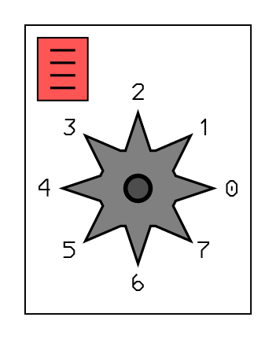

# BIOS do ODYSSEY 

18 JUN 1998 – Simon Scudder

Baseado num documento do Paul Robson

### Vetores do cartucho

```assembly
400        C_RESET EQU 0400            ; Inicio do cartucho
402        C_INT   EQU 0402            ; Rotina de interrupção
404        C_TIMR  EQU 0404            ; Rotina do temporizador
406        C_VBLK  EQU 0406            ; Rotina de intervalo vertical
408        C_STRT  EQU 0408            ; Rotina de inicio
40A        C_SND   EQU 040A            ; Rotina de som
```

### Endereços do VDC 8244

```assembly
0A0       SVCTRL    EQU A0              ; Registro de controle
0A1       SVSTAT    EQU A1              ; Registro de status
0A2       SVOVST    EQU A2              ; Registro de colisão
0A3       SVCOLR    EQU A3              ; Registro de cor
0A4       SVYSTR    EQU A4              ; Registro de posição Y do feixe
0A5       SVXSTR    EQU A5              ; Registro de posição X do feixe
0A7       SVSDSR    EQU A7              ; Registrador de deslocamento
0AA       SVSDCT    EQU AA              ; Registro de controle de som
0C0       SVGRIH    EQU C0              ; Grade horizontal col 0-7
0D0       SVGRIB    EQU D0              ; Grade horizontal col 8
0E0       SVGRIV    EQU E0              ; Grade vertical lin 0-7
```

# Disassembly da BIOS

## RESET (0000H)

Salta para para a rotina de início do cartucho em 400h

```assembly
000 84 00 RESET:    JMP C_RESET             ; 0400
002 00              NOP
```

## INTERRUPÇÃO EXTERNA (0003H)

Salta para a rotina de interrupção do cartucho em 0402h

```assembly
003 84 02 IRQ:      JMP C_INT               ; 0402
005 00              NOP
006 00              NOP
```

## INTERRUPÇÃO DO TEMPORIZADOR (0007H)

Salta para a rotina do temporizador do cartucho em 0404h

```assembly
007 84 04 TMRIRQ:   JMP C_TIMER             ; 0404 
```

## INTSVC (0009H)

Serviço padrão de interrupção vertical. Verifica se está em VBLANK, e se estiver, salta para a rotina do cartucho em 0406h

**Altera**: `A` (se estiver em VBLANK) `R5` `R6`

```assembly
009 C5    INTSVC:   SEL RB0
00A AD              MOV R5,A                ; Salva A em R5
00B 09              IN A,P1                 ; Pega configuração da porta 1
00C AE              MOV R6,A                ; Salva configuração da porta 1
00D 14 E7           CALL SL8244             ; 00E7
00F B8 A1           MOV R0,SVSTAT           ; Checa se está VBLANK
011 80              MOVX A,@R0              ; em $A1:3
012 72 18           JB3 VBLANK              ; 0018

014 FE    RESTOR:   MOV A,R6                ; Recupera configuração da porta 1
015 39              OUTL P1,A
016 FD              MOV A,R5                ; Recupera A
017 93              RETR

018 84 06 VBLANK:   JMP C_VBLK              ; 0406 
```

## VRTETY (001AH)

Rotina de interupção do intervalo vertical  - VBLANK.

- Ajusta `F1` (usado na rotina NXTINT)
- Salva o registro de colisão em $3D
- Atualiza contagem de campo em $3E (para o relógio)
- Verifica se há dados para copiar para o 8244 ($3F:7)
- Verifica se está tocando som ($3F:6)

**Altera**: `R0` `R1` `R3` `A` `F1`

```assembly
01A A5    VRTETY:   CLR F1                  ; Seta F1 para rotina NXTINT
01B B5              CPL F1
01C B9 A2           MOV R1,SVOVST           ; Salva registrador de colisõa
01E B8 3D           MOV R0,#3D              ; em $3D
020 81              MOVX A,@R1 
021 A0              MOV @R0,A
022 18              INC R0                  ; Aponta para $3E
023 10              INC @R0                 ; Increment field TIMER
024 F0              MOV A,@R0
025 53 3F           ANL A,#3F
027 D3 3C           XRL A,#3C               ; Vê se chegou em 60 campos
029 96 2F           JNZ LAB6                ; 002F
02B F0              MOV A,@R0
02C 53 C0           ANL A,#C0               ; Zera a contagem de campos
02E A0              MOV @R0,A       
02F 18    LAB6:     INC R0                  ; Aponta para $3F
030 F0              MOV A,@R0
031 37              CPL A
032 F2 3A           JB7 LAB7                ; 003A
034 37              CPL A
035 53 7F           ANL A,#7F
037 A0              MOV @R0,A
038 14 89           CALL OUTPUT             ; 0089
03A B9 3F LAB7:     MOV R1,#3F
03C F1              MOV A,@R1
03D 37              CPL A
03E D2 14           JB6 RESTOR              ; 0014
040 EB 14           DJNZ R3,RESTOR          ; 0014
042 84 0A           JMP C_SOUND             ; 040A
```

## INTSND (0044H)

Rotina de evento de som. Lê o próximo evento de som da página 3, e ajusta os registros do VDC
**Altera**: `A` `R1` `R2` `R4`

```assembly
044 FC    INTSND:   MOV A,R4
045 E3              MOVP3 A,@A              ; Pega o primeiro byte na página 3
046 A9              MOV R1,A
047 1C              INC R4
048 FC              MOV A,R4
049 E3              MOVP3 A,@A              ; Pega o segundo byte na página 3
04A AA              MOV R2,A
```

## EXSETY (004BH)

Rotina de tratamento de som, pode ser chamado pelo cartucho para gerar sons novos.

```assembly
04B F9              MOV A,R1
04C F2 5C           JB7 SNDB7               ; 005C
04E D2 73           JB6 SNDB6               ; 0073
050 B2 7D           JB5 SNDB5               ; 007D
052 92 84           JB4 SNDB4               ; 0084

054 B9 3F           MOV R1,#3F              ; Reseta $3F:6
056 F1              MOV A,@R1
057 53 BF           ANL A,#BF               ; 10111111
059 A1              MOV @R1,A
05A 04 14           JMP RESTOR              ; 0014
```

### TONEPT - Evento de som com bit 7 = 1

Novo tom.

**Altera**: `A` `R0` `R2` `R3`

```assembly
; Evento de tom no seguinte formato:
;
; 1 d d d d d d d onde d = duração do tom
; n n n n n n n n onde n = endereço da onda na página 3

05C 53 7F SNDB7:    ANL A,#7F               ; limpa o bit 7
05E AB              MOV R3,A
05F B8 AA           MOV R0,#AA
061 27              CLR A
062 90              MOVX @R0,A
063 B8 A7           MOV R0,#A7
065 B9 03           MOV R1,#03
067 FA    LAB55:    MOV A,R2
068 E3              MOVP3 A,@A
069 90              MOVX @R0,A
06A 18              INC R0
06B 1A              INC R2
06C E9 67           DJNZ R1,LAB55           ; 0067
06E FA              MOV A,R2
06F E3              MOVP3 A,@A              ; lê o byte na página 3
070 AA              MOV R2,A
071 04 76           JMP LAB56               ; 0076
```

### STATUS - Evento de som com bit 6 = 1

Altera registrador de status de som.

**Altera**: `A` `R0` `R3` `R4`

```assembly
; Evento de status no seguinte formato:
;
; 0 1 d d d d d d - d = duração do status novo
; n n n n n n n n - n = novo status de som

073 53 3F SNDB6:    ANL A,#3F
075 AB              MOV R3,A
076 1C    LAB56:    INC R4
077 B8 AA LAB57:    MOV R0,#SVSDCT          ; AA
079 FA              MOV A,R2
07A 90              MOVX @R0,A
07B 04 14           JMP RESTOR              ; 0014
```

### PAUSE - Evento de som com bit 5 = 1

Pausa no som

**Altera**: `A` `R2` `R3`

```assembly
; Evento de pausa no seguinte formato:
;
; 0 0 1 d d d d d - d = duração da pausa

07D 53 1F SNDB5:    ANL A,#1F
07F AB              MOV R3,A
080 BA 00           MOV R2,#00
082 04 77           JMP LAB57               ; 0077
```

### CHAIN - Evento de som com bit 4 = 1

Encadear outra tabela de sons.	

**Altera**: `A` `R4`

```assembly
084 FA    SNDB4:    MOV A,R2
085 AC              MOV R4,A
086 84 0A           JMP C_SND               ; 040A

088 00              NOP
```

## OUTPUT (0089H)

Rotina de cópia da RAM externa para VDC. Copia a estrutura de dados do final da RAM no VDC durante o intervalo vertical.

**Altera**: `A` `R0` `R1` `R2` `P1`

```assembly
089 B8 7F OUTPUT:   MOV R0,#7F
08B B9 A0 OUTP1:    MOV R1,SVCTRL
08D 81              MOVX A,@R1
08E 53 D6           ANL A,#D6
090 91              MOVX @R1,A
091 89 7C           ORL P1,#7C              ; Seta P1.2 P1.3 P1.4 P1.5 P1.6
093 99 E7           ANL P1,#E7              ; Reseta P1.3 P1.4
095 80    LAB59:    MOVX A,@R0
096 96 A3           JNZ LAB15               ; 00A3
098 89 BC           ORL P1,#BC
09A 99 B7           ANL P1,#B7
09C B9 A0           MOV R1,SVCTRL           ; A0
09E 81              MOVX A,@R1
09F 43 28           ORL A,#28
0A1 91              MOVX @R1,A
0A2 83              RET
0A3 AA    LAB15:    MOV R2,A
0A4 C8              DEC R0
0A5 80              MOVX A,@R0
0A6 A9              MOV R1,A
0A7 C8              DEC R0
0A8 80    LAB58:    MOVX A,@R0
0A9 91              MOVX @R1,A
0AA C8              DEC R0
0AB 19              INC R1
0AC EA A8           DJNZ R2,LAB58           ; 00A8
0AE 04 95           JMP LAB59               ; 0095
```

## KEYBD (00B0H)

Lê o teclado.

**Altera**: `A` `R0` `R1` `R2` `R6` `R7`

```assembly
0B0 15    KEYBRD:   DIS I
0B1 C5              SEL RB0
0B2 09              IN A,P1
0B3 AE              MOV R6,A
0B4 89 BC           ORL P1,#BC
0B6 99 BB           ANL P1,#BB
0B8 B8 F0           MOV R0,#F0
0BA BA 06           MOV R2,#06
0BC F8    LAB78:    MOV A,R0
0BD 3A              OUTL P2,A
0BE 0A              IN A,P2
0BF 92 DA           JB4 LAB60               ; 00DA
0C1 BA 30           MOV R2,#30
0C3 A8              MOV R0,A
0C4 0A    LAB62:    IN A,P2
0C5 D8              XRL A,R0
0C6 96 DF           JNZ LAB61               ; 00DF
0C8 EA C4           DJNZ R2,LAB62           ; 00C4
0CA F8              MOV A,R0
0CB 47              SWAP A
0CC 77              RR A
0CD D3 07           XRL A,#07
0CF 53 3F           ANL A,#3F
0D1 A9              MOV R1,A
0D2 FF              MOV A,R7
0D3 53 3F           ANL A,#3F
0D5 D9              XRL A,R1
0D6 96 E5           JNZ LAB63               ; 00E5
0D8 04 DF           JMP LAB61               ; 00DF

0DA 18    LAB60:    INC R0
0DB EA BC           DJNZ R2,LAB78           ; 00BC
0DD BF FF           MOV R7,#FF
0DF FF    LAB61:    MOV A,R7
0E0 43 C0           ORL A,#C0
0E2 AF              MOV R7,A
0E3 64 78           JMP 0378

0E5 64 76 LAB63:    JMP 0376
```

## SL8244 (00E7H)

Habilita o VDC8244 nas escritas de memória externa. Isto é feito setando P1.4 (desabilita ram externa), ressetando P1.3 (habilita 8244) e ressetando P1.6 (modo de cópia RAM->VDC).

**Altera**: `P1`

```assembly
0E7 89 BC SL8244:   ORL P1,#BC              ; seta P1.2, P1.3, P1.4, P1.5 e P1.7
0E9 99 B7           ANL P1,#B7              ; resseta P1.3 e P1.6
0EB 83              RET
```

## EXTRAM (00ECH)

Habilita a RAM para escritas de memória externa. Isto é feito setando P1.3 (desabilita 8244), ressetando P1.4 (habilita RAM) e ressetando P1.6 (modo de cópia RAM->VDC).

**Altera**: `P1`

```assembly
0EC 89 BC EXTRAM:   ORL P1,#BC              ; seta P1.2, P1.3, P1.4, P1.5, P1.7
0EE 99 AF           ANL P1,#AF              ; resseta P1.4 e P1.6
0F0 83              RET
```

## CLEAR (00F1H)

Inicializa o Odyssey, executando os seguintes passos:

- coloca `00` na memória interna nos endereço `20h` até `3Fh`
- coloca `00` na memória RAM externa nos endereços `00h` até `7Fh`
- desabilita o 8244
- coloca `00` no 8244 nos endereços `80h` até `FFh`
- coloca `F8` no 8244 nos endereços `00h` até `7Fh` (posiciona todos os objetos fora da tela)
- habilita o 8244

**Altera**: `A` `R0` `R1` `P1`

```assembly
0F1 89 BC CLEAR:    ORL P1,#BC              ; seleciona o 8244
0F3 99 B7           ANL P1,#B7
0F5 23 20           MOV A,#20               ; carrega acumulador com 020H
0F7 A8              MOV R0,A                ; copia para R0 e R1
0F8 A9              MOV R1,A
0F9 27              CLR A                   ; limpa o registador A
0FA A0    VLOOP:    MOV @R0,A               ; salva no endereço @R0
0FB 18              INC R0                  ; byte seguinte
0FC E9 FA           DJNZ R1,VLOOP
0FE 14 EC           CALL EXTRAM             ; Seleciona a RAM
100 B9 FF           MOV R1,#FF              ; aponta para o byte 0FFH
102 91    RLOOP:    MOVX @R1,A              ; salva 0 no endereço
103 E9 02           DJNZ R1,RLOOP
105 91              MOVX @R1,A              ; salva 0 no endereço 0
106 14 E7           CALL SL8244             ; seleciona o VDC
108 34 1C           CALL DISABL             ; desabilita o VDC para poder alterar
10A B8 FF           MOV R0,#FF              ; aponta para o byte 0FFH
10C B9 80           MOV R1,#80              ; quantidade de bytes: 128
10E 27              CLR A                   ; limpa o registrador A
10F 90    V1LOOP:   MOVX @R0,A              ; salva no endereço @R0
110 C8              DEC R0                  ; byte anterior
111 E9 0F           DJNZ R1,V1LOOP
113 23 F8           MOV A,#F8               ; carrega 0F8H no acumulador, posicionando tudo fora da tela
115 90    LAB72:    MOVX @R0,A              ; salva no endereço @R0
116 E8 15           DJNZ R0,LAB72
118 90              MOVX @R0,A              ; salva 0F8H no endereço 0
119 34 27           CALL ENABLE             ; habilita o VDC
11B 83              RET                     ; retorna
```

## DISABL (011CH)

Desabilita a grade e os objetos maiores e menores. Precisam estar desativados para escritas para estes objetos serem reconhecidas pelo 8244. O 8244 deve estar habilitado para esta rotina funcionar.

Desabilita as interrupções para poder usar o banco de registradores `RB0`.

**Altera**: `A` `R0`

```assembly
11C 15    DISABL:   DIS I                   ; desabilita interrupções
11D C5              SEL RB0                 ; seleciona banco de registradores 0
11E B8 A0           MOV R0,#SVCTRL          ; A0
120 80              MOVX A,@R0              ; pega o valor do registrador de controle
121 53 D6           ANL A,#D6               ; Resseta bits 5, 3 e 0
                                            ; (desabilita a grade, objetos maiores 
                                            ; e menores, e interrupção de linha)
123 90              MOVX @R0,A              ; salva no registrador de controle
124 D5              SEL RB1                 ; seleciona o banco de registradores 1
125 05              EN I                    ; habilita interrupções
126 83              RET                     ; retorna
```

## ENABLE (0127H)

Habilita a grade e os objetos maiores e menores. Escritas nestes objetos do 8244 não serão reconhecidas enquanto estiverem ativos. O 8244 deve estar habilitado para esta rotina funcionar.

Desabilita as interrupções para usar o banco de registradores `RB0`.

**Altera**: `A` `R0`

```assembly
127 15    ENABLE:   DIS I                   ; desabilita interrupções
128 C5              SEL RB0                 ; seleciona banco de registradores 0
129 B8 A0           MOV R0,#SVCTRL          ; Registrador de controle do 8244
12B 80              MOVX A,@R0
12C 43 28           ORL A,#28               ; Seta bits 5 e 3
                                            ; (habilita grade, objetos maiores e menores)
12E 90              MOVX @R0,A
12F D5              SEL RB1                 ; seleciona banco de registradores 1
130 05              EN I                    ; habilita interrupções
131 83              RET                     ; retorna
```

## OTFGST (0132H)

Seta o flag indicando que há dados para serem copiados da RAM para o VDC no próximo intervalo vertical. O flag fica na RAM interna do 8048 em 03FH:7

**Altera**: `A` `R0`

```assembly
132 27    OTFGST:   CLR A
133 90              MOVX @R0,A
134 B8 3F           MOV R0,#3F
136 F0              MOV A,@R0
137 43 80           ORL A,#80
139 A0              MOV @R0,A
13A 14 E7 LAB26:    CALL SL8244             ; Seleciona o 8244
13C 83              RET
```

## KEYCHK (013DH)

Espera pressionar uma tecla, toca o som de tecla e retorna.

**Altera**: `A`

```assembly
13D 34 76 KEYCHK:   CALL NXTINT             ; 0176
13F 14 B0           CALL KEYBRD             ; 00B0
141 F2 3D           JB7 KEYCHK              ; 013D
143 23 56           MOV A,#TONE4            ; 0356
145 34 A2           CALL SNDSET             ; 01A2
147 C5              SEL RB0
148 FF              MOV A,R7
149 D5              SEL RB1
14A 83              RET
```

## LSSCAL (014BH)

Calcula o valor LSS de um objeto maior.

**Altera**: `A` `R5` `R6`

```assembly
14B FE    LSSCAL:   MOV A,R6
14C 53 FE           ANL A,#FE
14E AE              MOV R6,A
14F FD              MOV A,R5
150 97              CLR C
151 F7              RLC A
152 F7              RLC A
153 F7              RLC A
154 AD              MOV R5,A
155 27              CLR A
156 F7              RLC A
157 4E              ORL A,R6
158 AE              MOV R6,A
159 FC              MOV A,R4
15A 67              RRC A
15B 37              CPL A
15C 17              INC A
15D 6D              ADD A,R5
15E AD              MOV R5,A
15F F6 6A           JC LAB82                ; 016A
161 FE              MOV A,R6
162 37              CPL A
163 53 01           ANL A,#01
165 2E              XCH A,R6
166 53 FE           ANL A,#FE
168 4E              ORL A,R6
169 AE              MOV R6,A
16A 83    LAB82:    RET
```

## CLRMAJ (016BH)

Limpa os objetos maiors no VDC 8244, usando a rotina CLRMJ (0171H)

**Altera**: `A` `R0` `R2`

```assembly
16B 23 F8 CLRMAJ:   MOV A,#F8               ; posição fora da tela
16D B8 10           MOV R0,#SVMAJ1          ; 10
16F BA 30           MOV R2,#30              ; Quantidade de bytes

```

## CLRMJ (0171H)

```assembly
171 90    CLRMJ:    MOVX @R0,A
172 18              INC R0
173 EA 71           DJNZ R2,CLRMJ           ; 0171
175 83    RETURN:   RET
```

## NXTINT (0176H)

Aguarda até o próximo intervalo vertical, testando o flag `F1` para saber quando ocorreu VBLANK.

```assembly
176 A5    NXTINT:   CLR F1
177 05              EN I
178 76 75 WAIT:     JF1 RETURN              ; 0175
17A 24 78           JMP WAIT                ; 0178 
```

## SCORE (017CH)

Mostrar um placar. `A` deve conter o valor em BCD, `R1`, o endereço do objeto maior; `R3`, a coordenada X; `R4` a coordenada Y; `R6`, a cor.

**Altera**: `A` `R0` `R2` `R5` `P1`

```assembly
17C 14 EC SCORE:    CALL EXTRAM             ; 00EC
17E AA              MOV R2,A
17F B8 7F           MOV R0,#7F
181 23 08           MOV A,#08
183 90              MOVX @R0,A
184 C8              DEC R0
185 F9              MOV A,R1
186 90              MOVX @R0,A
187 C8              DEC R0
188 FA              MOV A,R2
189 47              SWAP A
18A 53 0F           ANL A,#0F
18C AD              MOV R5,A
18D 34 97           CALL SCROUT             ; 0197
18F FA              MOV A,R2
190 53 0F           ANL A,#0F
192 AD              MOV R5,A
193 34 97           CALL SCROUT             ; 0197
195 24 32           JMP OTFGST              ; 0132
```

## SCROUT (0197H)

Calcula o LSS e salva os dados de um objeto maior no pacote de dados.

**Altera**: `A` `R0` `R3`

```assembly
197 FC    SCROUT:   MOV A,R4
198 90              MOVX @R0,A
199 C8              DEC R0
19A FB              MOV A,R3
19B 90              MOVX @R0,A
19C C8              DEC R0
19D 03 08           ADD A,#08
19F AB              MOV R3,A
1A0 44 2C           JMP GEN1                ; 022C
```

## SNDSET (01A2H)

Rotina de preparo de som, `A` deve conter o código do som a tocar na página 3. A rotina seta $3F:6, indicando que o som deve ser tocado.

**Altera**: `A` `R0` `R3` `R4`

```assembly
1A2 15    SNDSET:   DIS I                   ; Disable interrupts
1A3 C5              SEL RB0                 ; Select Low Bank
1A4 AC              MOV R4,A                ; Put pointer in R4
1A5 BB 01           MOV R3,#01              ; Wait 1 field before starting
1A7 B8 3F           MOV R0,#3F
1A9 F0              MOV A,@R0
1AA 43 40           ORL A,#40
1AC A0              MOV @R0,A               ; Set bit 6
1AD D5              SEL RB1                 ; Select High Bank
1AE 05              EN I                    ; Enable interrupts
1AF 83              RET
```

## TIMER (01B0H)

Exibe um temporizador na tela (MM:SS).

```assembly
1B0 B8 3E TIMER:    MOV R0,#3E
1B2 F0              MOV A,@R0
1B3 F2 3A           JB7 LAB26               ; 013A
1B5 53 3F           ANL A,#3F
1B7 D3 3B           XRL A,#3B
1B9 96 3A           JNZ LAB26               ; 013A
1BB 14 EC           CALL EXTRAM             ; 00EC
1BD F0              MOV A,@R0
1BE B8 02           MOV R0,#02
1C0 B9 01           MOV R1,#01
1C2 D2 E2           JB6 LAB27               ; 01E2
1C4 BA 99           MOV R2,#99
1C6 80              MOVX A,@R0
1C7 C6 CE           JZ LAB28                ; 01CE
1C9 6A              ADD A,R2
1CA 57              DAA
1CB 90              MOVX @R0,A
1CC 24 FC           JMP OUTP                ; 01FC

1CE 81    LAB28:    MOVX A,@R1
1CF C6 DA           JZ LAB66                ; 01DA
1D1 23 59           MOV A,#59
1D3 90              MOVX @R0,A
1D4 81              MOVX A,@R1
1D5 6A              ADD A,R2
1D6 57              DAA
1D7 91              MOVX @R1,A
1D8 24 FC           JMP OUTP                ; 01FC

1DA B8 3E LAB66:    MOV R0,#3E
1DC F0              MOV A,@R0
1DD 43 80           ORL A,#80
1DF A0              MOV @R0,A               ; Set $3E:7
1E0 24 3A           JMP 013A

1E2 BA 01 LAB27:    MOV R2,#01
1E4 80              MOVX A,@R0
1E5 D3 59           XRL A,#59
1E7 C6 EF           JZ LAB65                ; 01EF
1E9 80              MOVX A,@R0
1EA 6A              ADD A,R2
1EB 57              DAA
1EC 90              MOVX @R0,A
1ED 24 FC           JMP OUTP                ; 01FC

1EF 90    LAB65:    MOVX @R0,A
1F0 81              MOVX A,@R1
1F1 D3 59           XRL A,#59
1F3 96 F8           JNZ LAB81               ; 01F8
1F5 91              MOVX @R1,A
1F6 24 FC           JMP OUTP                ; 01FC

1F8 81    LAB81:    MOVX A,@R1
1F9 6A              ADD A,R2
1FA 57              DAA
1FB 91              MOVX @R1,A
```

## OUTP (01FCH)


```assembly
1FC B8 7F OUTP:    MOV R0,#7F
1FE 54 35           CALL 0235
200 23 42           MOV A,#42
202 90              MOVX @R0,A
203 C8              DEC R0
204 B9 01           MOV R1,#01
206 81              MOVX A,@R1
207 47              SWAP A
208 54 29           CALL GEN                ; 0229
20A 54 35           CALL 0235
20C 23 52           MOV A,#52
20E 90              MOVX @R0,A
20F C8              DEC R0
210 81              MOVX A,@R1
211 54 29           CALL GEN                ; 0229
213 54 35           CALL 0235
215 23 56           MOV A,#56
217 90              MOVX @R0,A
218 C8              DEC R0
219 19              INC R1
21A 81              MOVX A,@R1
21B 47              SWAP A
21C 54 29           CALL GEN                ; 0229
21E 54 35           CALL 0235
220 23 4A           MOV A,#4A
222 90              MOVX @R0,A
223 C8              DEC R0
224 81              MOVX A,@R1
225 54 29           CALL GEN                ; 0229
227 24 32           JMP OTFGST              ; 0132


```

## GEN (0229H)

Calcula o LSS e move bytes 3 e 4 de um objeto maior para o pacote de dados. RAM Externa deve estar selecionado; `A` deve conter o código da chave; `R0` deve conter o endereço no pacote de dados; `R4`, a coordenada Y; e `R6,` a cor.

Altera: `A` `R0` `R5`

```assembly
229 53 0F GEN:      ANL A,#0F
22B AD              MOV R5,A
```

## GEN1 (022C)

Continuação de GEN. Chamado se o código da chave já estiver em R5.

Altera: `A` `R0`

```assembly
22C 34 4B GENI:     CALL LSSCAL             ; 014B
22E FD              MOV A,R5
22F 90              MOVX @R0,A
230 C8              DEC R0
231 FE              MOV A,R6
232 90              MOVX @R0,A
233 C8              DEC R0
234 83              RET
```

```assembly
235 23 02 LAB67:    MOV A,#02
237 90              MOVX @R0,A
238 C8              DEC R0
239 83              RET
```

## TIMINT (023AH)

Inicializa o temporizador do placar (MM:SS).

```assembly
23A B8 40           MOV R0,#40
23C B9 50           MOV R1,#50
23E FC              MOV A,R4
23F 90              MOVX @R0,A
240 91              MOVX @R1,A
241 18              INC R0
242 19              INC R1
243 FB              MOV A,R3
244 90              MOVX @R0,A
245 03 08           ADD A,#08
247 91              MOVX @R1,A
248 BD 0A           MOV R5,#0A
24A B8 46           MOV R0,#46
24C 54 61           CALL 0261
24E BD 0C           MOV R5,#0C
250 B8 4E           MOV R0,#4E
252 54 61           CALL 0261
254 BD 0C           MOV R5,#0C
256 B8 5A           MOV R0,#5A
258 54 61           CALL 0261
25A BD 0C           MOV R5,#0C
25C B8 5E           MOV R0,#5E
25E 54 61           CALL 0261
260 83              RET
```

## LDMAJ (0261H)

Calcula o LSS de um objeto maior e carrega no 8244.

Altera: `A` `R0`

```assembly
261 34 4B LDMAJ:    CALL LSSCAL             ; 014B
263 FD              MOV A,R5
264 90              MOVX @R0,A
265 18              INC R0
266 FE              MOV A,R6
267 90              MOVX @R0,A
268 18              INC R0
269 83              RET
```

## TDBT (026AH)

Testa um bit na RAM (externa ou VDC).

```assembly
26A 07    TDBT:     DEC A
26B BA F8           MOV R2,#F8
26D 6A    LAB38:    ADD A,R2
26E C9              DEC R1
26F F6 6D           JC LAB38                ; 026D
271 6A              ADD A,R2
272 53 07           ANL A,#07
274 17              INC A
275 AA              MOV R2,A
276 27              CLR A
277 97              CLR C
278 A7              CPL C
279 F7    LAB39:    RLC A
27A EA 79           DJNZ R2,LAB39           ; 0279
27C AA              MOV R2,A
27D 81              MOVX A,@R1
27E 5A              ANL A,R2
27F 83              RET
```

## RDBT (0280H)

Limpa bit na RAM (externa ou VDC). `A` deve conter a mascará com o bit a ser ressetado.

Altera: `A` `R2`

```assembly
280 54 6A RDBT:     CALL TDBT               ; 026A
282 C6 89           JZ LAB41                ; 0289
284 81              MOVX A,@R1
285 DA              XRL A,R2
286 91              MOVX @R1,A
287 27              CLR A
288 17              INC A
289 83    LAB41:    RET
```

## SDBT (028AH)

Seta um bit na RAM (externa ou VDC).

**Altera**: `A`

```assembly
28A 54 6A SDBT:     CALL TDBT                   ; 026A
28C 96 92           JNZ LAB42                   ; 0292
28E 81              MOVX A,@R1
28F DA              XRL A,R2
290 91              MOVX @R1,A
291 27              CLR A
292 83    LAB42:    RET
```

## RNDM2 (0293H)

Gerador de números aleatórios usando o timer.

```assembly
293 42              MOV A,T
294 AC              MOV R4,A
295 53 0F           ANL A,#0F
297 AD              MOV R5,A
298 54 A4           CALL RNDM               ; 02A4
29A 2A              XCH A,R2
29B AF              MOV R7,A
29C FC              MOV A,R4
29D 53 F0           ANL A,#F0
29F 47              SWAP A
2A0 AD              MOV R5,A
2A1 54 A4           CALL 02A4
2A3 83              RET
```

## RNDM (02A4H)

Gerador de números aleatórios. `R5` contém a semente e `R7` o - (valor máximo + 1).

```assembly
2A4 FD    LAB43:    MOV A,R5
2A5 03 B3           ADD A,#B3
2A7 A3              MOVP A,@A
2A8 96 AC           JNZ LAB74               ; 02AC
2AA AD              MOV R5,A
2AB CD              DEC R5
2AC 1D    LAB74:    INC R5
2AD AB              MOV R3,A
2AE 6F              ADD A,R7
2AF F6 A4           JC LAB43                ; 02A4
2B1 FB              MOV A,R3
2B2 83              RET
```

Tabela de valores usado no gerador de números aleatórios:

```assembly
2B3 0F              DB 0F                   ; ....XXXX
2B4 0E              DB 0E                   ; ....XXX.
2B5 0D              DB 0D                   ; ....XX.X
2B6 02              DB 02                   ; ......X.
2B7 0A              DB 0A                   ; ....X.X.
2B8 05              DB 05                   ; .....X.X
2B9 0B              DB 0B                   ; ....X.XX
2BA 03              DB 03                   ; ......XX
2BB 06              DB 06                   ; .....XX.
2BC 0C              DB 0C                   ; ....XX..
2BD 09              DB 09                   ; ....X..X
2BE 01              DB 01                   ; .......X
2BF 04              DB 04                   ; .....X..
2C0 08              DB 08                   ; ....X...
2C1 07              DB 07                   ; .....XXX
2C2 00              DB 00                   ; ........
```

## START (02C3H)

Limpa a tela, escreve "SELECT GAME" sobre o fundo preto em várias cores e toca o som do Odyssey.

```assembly
2C3 BF FF START:    MOV R7,#FF
2C5 D5              SEL RB1
2C6 14 F1           CALL CLEAR              ; 00F1
2C8 B9 F2           MOV R1,#F2
2CA B8 10           MOV R0,#10 
2CC BA 0B           MOV R2,#0B              ; número de caracteres
2CE BB 28           MOV R3,#28
2D0 BC 70           MOV R4,#70
2D2 BE 04           MOV R6,#04
2D4 34 1C           CALL DISABL             ; 011C
2D6 F9    SLOOP:    MOV A,R1
2D7 A3              MOVP A,@A
2D8 AD              MOV R5,A
2D9 74 EA           CALL OPMJ               ; 03EA
2DB 19              INC R1
2DC 1E              INC R6
2DD 1E              INC R6
2DE EA D6           DJNZ R2,SLOOP           ; 02D6
2E0 34 27           CALL ENABLE             ; 0127
2E2 23 4A           MOV A,#SCLUP
2E4 34 A2           CALL SNDSET             ; 01A2
2E6 34 3D           CALL KEYCHK             ; 013D
2E8 A9              MOV R1,A
2E9 34 1C           CALL DISABL             ; 011C
2EB 34 6B           CALL CLRMAJ             ; 016B
2ED 34 27           CALL ENABLE             ; 0127
2EF F9              MOV A,R1
2F0 84 08           JMP C_START             ; 0408

2F2 19              DB 19   ; S
2F3 12              DB 12   ; E
2F4 0E              DB 0E   ; L
2F5 12              DB 12   ; E
2F6 23              DB 23   ; C
2F7 14              DB 14   ; T
2F8 0C              DB 0C   ; <space>
2F9 1C              DB 1C   ; G
2FA 20              DB 20   ; A
2FB 26              DB 26   ; M
2FC 12              DB 12   ; E

2FD 20              DB 20
2FE 20              DB 20
2FF 20              DB 20
```

A partir do endereço 0300H temos várias tabelas de dados usados na rotina de geração de som. Isto é para poder usar a instrução MOV3 A,@A pra ler os dados diretamente da página 3.

## Frequências de som

São conjuntos de 24 bits, que são recirculados no registrador de deslocamento de geração de som. Os primeiros 3 bytes são a onda, e o último byte é o conteúdo do registrador de controle de som. Todos os sons são volume 15, o máximo. As primeiras 5 frequências usam a frequência de deslocamento de 983Hz, e os restantes, a frequencia de deslocamento de 3933Hz.

Na versão PAL são consideradas frequências ligeiramente superiores (valores entre parentesis).

### SQS042

Onda com 12 `0`s, seguidos de 12 `1`s. Som com frequência de 40,95Hz (42Hz).

```assembly
300 00    SQS042:   DB 00                   ; ............XXXXXXXXXXXX
301 0F              DB 0F                   ; 
302 FF              DB FF                   ; 
303 CF              DB CF                   ; XX..XXXX 
```

### SQS083

Onda com 6 `0`s seguidos de 6 `1`s. Som com frequência de 81,91Hz (83Hz).

```assembly
304 03    SQS083:   DB 03                   ; ......XXXXXX......XXXXXX
305 F0              DB F0                   ; 
306 3F              DB 3F                   ; 
307 CF              DB CF                   ; XX..XXXX 
```

### SQS125

Onda com 4 `0`s seguidos de 4 `1`s. Som com frequência de 122,87 Hz (125Hz).

```assembly
308 0F    SQS125:   DB 0F                   ; ....XXXX....XXXX....XXXX
309 0F              DB 0F                   ; 
30A 0F              DB 0F                   ; 
30B CF              DB CF                   ; XX..XXXX 
```

### SQS167

Onda com 3 `0`s seguidos de 3 `1`s. Som com frequência de 163,83Hz (167Hz).

```assembly
30C 1C    SQS167:   DB 1C                   ; ...XXX...XXX...XXX...XXX
30D 71              DB 71                   ; 
30E C7              DB C7                   ; 
30F CF              DB CF                   ; XX..XXXX
```

### SQS250

Onda com 2 `0`s seguidos de 2 `1`s. Som com frequência de 245,75Hz (250Hz).

```assembly
310 33    SQS250:   DB 33                   ; ..XX..XX..XX..XX..XX..XX
311 33              DB 33                   ; 
312 33              DB 33                   ; 
313 CF              DB CF                   ; XX..XXXX 
```

### SQS333

Onda com 12 `0`s e 12 `1`s a uma frequência de deslocamento de 3993Hz. Som com frequência de 327,75Hz (333 Hz).

```assembly
314 03    SQS333:   DB 03                   ; ......XXXXXX......XXXXXX
315 F0              DB F0                   ; 
316 3F              DB 3F                   ; 
317 EF              DB EF                   ; XXX.XXXX
```

### SQS500

Onda com 4 `0`s seguido de 4 `1`s. Som com frequência de 491,62Hz (500Hz).

```assembly
318 0F    SQS500:   DB 0F                   ; ....XXXX....XXXX....XXXX
319 0F              DB 0F                   ; 
31A 0F              DB 0F                   ;  
31B EF              DB EF                   ; XXX.XXXX
```

### SQS667

Onda com 3 `0`s seguido de 3 `1`s. Som com frequência de 655,5Hz (667Hz).

```assembly
31C 1C    SQS667:   DB 1C                   ; ...XXX...XXX...XXX...XXX
31D 71              DB 71                   ; 
31E C7              DB C7                   ; 
31F EF              DB EF                   ; XXX.XXXX
```

### SQS01K

Onda com 2 `0`s seguido de 2 `1`s. Som com frequência de 983,25Hz (1KHz).

```assembly
320 33    SQS01K:   DB 33                   ; ..XX..XX..XX..XX..XX..XX
321 33              DB 33                   ; 
322 33              DB 33                   ; 
323 EF              DB EF                   ; XXX.XXXX
```

### SQS02K

Onda com 1 `0` seguido de 1 `1`. Som com frequência de 1966,5Hz (2KHz).

```assembly
324 55    SQS02K:   DB 55                   ; .X.X.X.X.X.X.X.X.X.X.X.X
325 55              DB 55                   ; 
326 55              DB 55                   ; 
327 EF              DB EF                   ; XXX.XXXX
```

##  Sons internos

São sons usados pela maioria dos cartuchos.

### TONE2 - Som de erro

```assembly
328 90 10 TONE2:    DB 90 10                ; Som do 0310H por 16 campos
32A 94 00           DB 94 00                ; Som do 0300H por 20 campos
32C 21              DB 21                   ; Pausa de 1 campo
32D 00              DB 00                   ; Silêncio
```

### CRASH - Som de explosão

```assembly
32E 56 DF CRASH:    DB 56 DF                ; Ruido por 22 campos/volume 15
330 53 DD           DB 53 DD                ; Ruido por 19 campos/volume 13
332 50 DA           DB 50 DA                ; Ruido por 16 campos/volume 10
334 4D D8           DB 4D D8                ; Ruido por 13 campos/volume 8
336 4A D5           DB 4A D5                ; Ruido por 10 campos/volume 5
338 47 D2           DB 47 D2                ; Ruido por 7 campos/volume 2
33A 21              DB 21                   ; Pausa de 1 campo
33B 00              DB 00                   ; Silêncio
```

### TONE1 - Som de alarme

O som de alarme toca os dois tons alternando o bit 5 do registrador de controle, usando a mesma forma de onda de 2 `0`s seguido de 2 `1`s. Faz isto ao invés de alternar entre o SQS250 e SQS01K para poder controlar o volume.

```assembly
33C 92 20 TONE1:    DB 92 20                ; Som do 0320H por 18 campos
33E 4A CD           DB 4A CD                ; Toca 250Hz por 10 campos/volume 13
340 52 EB           DB 52 EB                ; Toca 1KHz por 18 campos/volume 11
342 4A C9           DB 4A C9                ; Toca 250Hz por 10 campos/volume 9
344 52 E7           DB 52 E7                ; Toca 1KHz por 18 campos/volume 7
346 4A C5           DB 4A C5                ; Toca 250Hz por 10 campos/volume 5
348 21              DB 21                   ; Pausa de 1 campo
349 00              DB 00                   ; Silêncio
```

### SCLUP - Som do SELECT GAME

```assembly
34A 85 04 SCLUP:    DB 85 04                ; Som do 0304H por 5 campos
34C 85 0C           DB 85 0C                ; Som do 030CH por 5 campos
34E 85 14           DB 85 14                ; Som do 0314H por 5 campos
350 85 1C           DB 85 1C                ; Som do 031CH por 5 campos
352 85 24           DB 85 24                ; Som do 0324H por 5 campos
354 21              DB 21                   ; Pausa de 1 campo
355 00              DB 00                   ; Silêncio
```

### TONE4 - Clique do teclado

```assembly
356 82 1C TONE4:    DB 82 1C                ; Som do 031CH por 2 campos
358 21              DB 21                   ; Pausa de 1 campo
359 00              DB 00                   ; Silêncio
```

### TONE5 - Cigarra

```assembly
35A 8A 00 TONE5:    DB 8A 00                ; Som do 0300H por 10 campos
35C 21              DB 21                   ; Pausa de 1 campo
35D 00              DB 00                   ; Silêncio
```

### SCLDN - SELECT GAME invertido

Usado no Cryptologic.

```assembly
35E 85 24 SCLDN:    DB 85 24                ; Som do 0324H por 5 campos
360 85 1C           DB 85 1C                ; Som do 031CH por 5 campos
362 85 14           DB 85 14                ; Som do 0314H por 5 campos
364 85 0C           DB 85 0C                ; Som do 030CH por 5 campos
366 85 04           DB 85 04                ; Som do 0304H por 5 campos
368 21              DB 21                   ; Pausa de 1 campo
369 00              DB 00                   ; Silêncio
```

### GUNSHT - Tiro

Usa a frequência de deslocamento de 3933Hz.

```assembly
36A 44 FF GUNSHT:   DB 44 FF                ; Ruido por 4 campos/volume 15
36C 4D DD           DB 4D DD                ; Ruido por 13 campos/volume 13
36E 48 DA           DB 48 DA                ; Ruido por 8 campos/volume 10
370 44 D5           DB 44 D5                ; Ruido por 4 campos/volume 5
372 42 D3           DB 42 D3                ; Ruido por 2 campos/volume 3
374 21              DB 21                   ; Pausa de 1 campo
375 00              DB 00                   ; Silêncio
```

## Continuação da rotina do teclado

```assembly
376 F9    LAB80:    MOV A,R1
377 AF              MOV R7,A
378 FE    LAB79:    MOV A,R6
379 39              OUTL P1,A
37A FF              MOV A,R7
37B D5              SEL RB1
37C 05              EN I
37D 83              RET
```

## Resseta P10

```assembly
37E 20              XCH A,@R0
37F 99 FE           ANL P1,#FE              ; Reset P10
381 84 08           JMP C_START             ; 0408 
```

## Resseta P11

```assembly
383 99 FD           ANL P1,#FD              ; Reset P11
385 84 08           JMP C_START             ; 0408
```

## Resseta P10 e P11

```assembly
387 99 FC           ANL P1,#FC              ; Reset P10 and P11
389 84 08           JMP C_START             ; 0408
```

## Seta P10 e P11

```assembly
38B 89 03           ORL P1,#03              ; Set P10 and P11
38D 84 08           JMP C_START             ; 0408
```

## RESOLV (038FH)

Rotina de leitura dos joysticks. R1 deve conter 0 ou 1 para selecionar o joystick. Retorna R2 e R3 com delta e F0 se o botão de ação estiver pressionado.

**Altera**: A, R0, R1, R2, R3, F0, P1, P2

```assembly
38F 09    RESOLV:   IN A,P1
390 A8              MOV R0,A
391 89 BC           ORL P1,#BC

393 99 9B           ANL P1,#9B
395 F9              MOV A,R1
396 43 F0           ORL A,#F0
398 3A              OUTL P2,A
399 85              CLR F0
39A 27              CLR A
39B AA              MOV R2,A
39C AB              MOV R3,A
39D 08              INS A,BUS
39E A9              MOV R1,A
39F 12 A2           JB0 LAB46               ; 03A2
3A1 CB              DEC R3
3A2 32 A5 LAB46:    JB1 LAB47               ; 03A5
3A4 1A              INC R2
3A5 52 A8 LAB47:    JBZ LAB48               ; 03A8
3A7 1B              INC R3
3A8 72 AB LAB48:    JB3 LAB49               ; 03AB
3AA CA              DEC R2
3AB 92 AE LAB49:    JB4 LAB50               ; 03AE
3AD 95              CPL F0
3AE F8    LAB50:    MOV A,R0
3AF 39              OUTL P1,A
3B0 83              RET
```

## CALHD (03B1H)

Calcula a direção da posição do joystick, de acordo com esse desenho:



Só deve ser chamado se o joystick não estiver centralizado

**Altera**: `R0` `R1`

```assembly
3B1 FB    CALHD:    MOV A,R3
3B2 53 0F           ANL A,#0F
3B4 A8              MOV R0,A
3B5 FA              MOV A,R2
3B6 53 0F           ANL A,#0F
3B8 47              SWAP A
3B9 48              ORL A,R0
3BA A8              MOV R0,A
3BB B9 07           MOV R1,#07
3BD 23 C7 LAB52:    MOV A,#C7
3BF 69              ADD A,R1
3C0 A3              MOVP A,@A
3C1 D8              XRL A,R0
3C2 C6 C6           JZ LAB51                ; 03C6
3C4 E9 BD           DJNZ R1,LAB52           ; 03BD
3C6 83    LAB51:    RET


```

Esta tabela pega os valores de nibbles de deltas (X e Y) na ordem da direção (1-8):

```assembly
3C7 10              DB 10                   ; ...X....
3C8 1F              DB 1F                   ; ...XXXXX
3C9 0F              DB 0F                   ; ....XXXX
3CA FF              DB FF                   ; XXXXXXXX
3CB F0              DB F0                   ; XXXX....
3CC F1              DB F1                   ; XXXX...X
3CD 01              DB 01                   ; .......X
3CE 11              DB 11                   ; ...X...X
```

## DVDE (03CFH)

Divide `R2` por `R3`, colocando o quociente em `R4`, e o resto em `R5`.

**Altera**: `A` `R4` `R5` `R6`

```assembly
3CF BC FF DVDE:     MOV R4,#FF
3D1 FB              MOV A,R3
3D2 37              CPL A
3D3 17              INC A
3D4 AE              MOV R6,A
3D5 FA              MOV A,R2
3D6 6E    LAB44:    ADD A,R6
3D7 1C              INC R4
3D8 F6 D6           JC LAB44                ; 03D6
3DA 6B              ADD A,R3
3DB AD              MOV R5,A
3DC 83              RET
```

## MULT (03DDH)

Multiplica os valores de R2 e R3.

**Altera**: `A`, `R2`

```assembly
3DD FA    MULT:     MOV A,R2
3DE 96 E1           JNZ LAB45               ; 03E1
3E0 83              RET

3E1 FB    LAB45:    MOV A,R3
3E2 96 E5           JNZ LAB75               ; 03E5
3E4 83              RET
3E5 27    LAB75:    CLR A
3E6 6B    LAB83:    ADD A,R3
3E7 EA E6           DJNZ R2,LAB83           ; 03E6
3E9 83              RET
```

## OPMJ (03EAH)

Calcula o LSS de um Objeto Maior e carrega o Maior no VDC. `R0` deve conter o endereço do maior onde sera carregado; `R3`, a coordenada X; `R4`, a coordenada Y; `R5`, o caracter; e `R6`, a cor.

**Altera**: `A` `R0` `R3`

```assembly
3EA FC    OPMJ:     MOV A,R4
3EB 90              MOVX @R0,A
3EC 18              INC R0
3ED F8              MOV A,R0
3EE D2 F9           JB6 LAB53               ; 03F9
3F0 FB    LAB76:    MOV A,R3
3F1 90              MOVX @R0,A
3F2 03 08           ADD A,#08
3F4 AB              MOV R3,A
3F5 18    LAB77:    INC R0
3F6 54 61           CALL 0261
3F8 83              RET

3F9 53 0F LAB53:    ANL A,#0F
3FB 07              DEC A
3FC C6 F0           JZ LAB76                ; 03F0
3FE 64 F5           JMP 03F5
```

